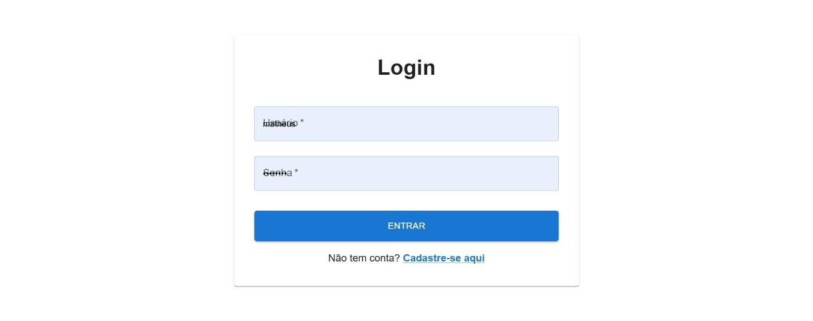
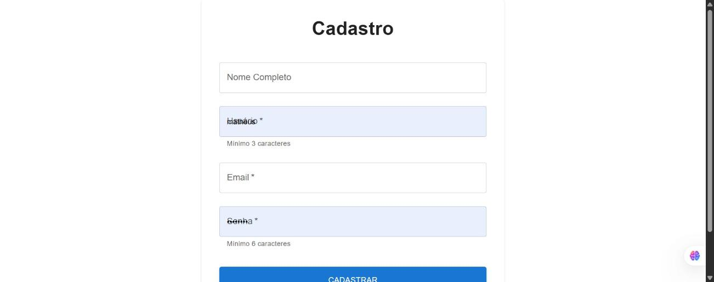
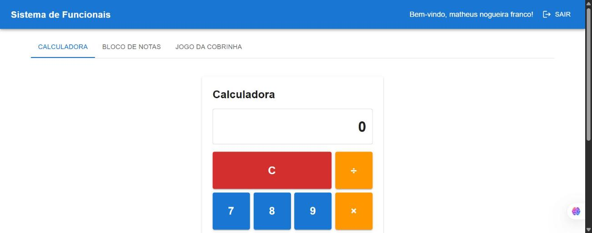
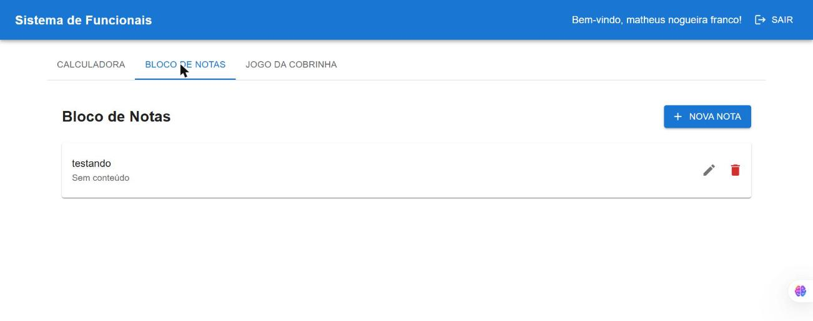
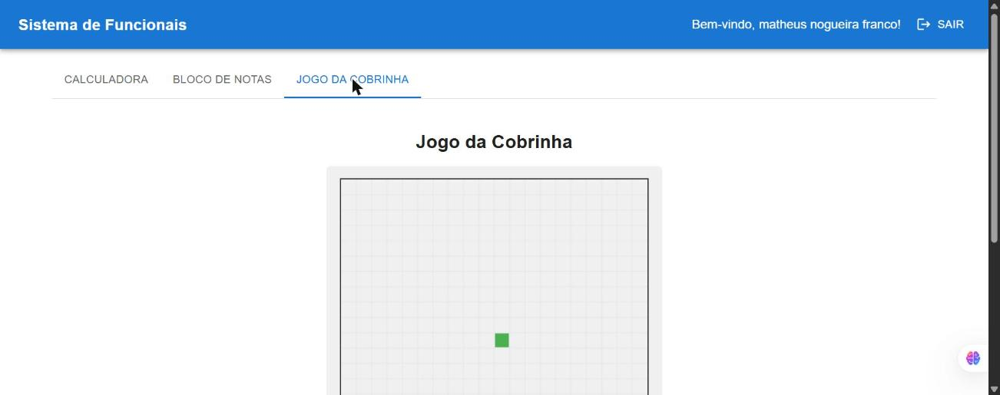

# Sistema de Cadastro e Funcionalidades

Um sistema completo de cadastro e login com FastAPI no backend e React no frontend, incluindo Calculadora, Bloco de Notas e Jogo da Cobrinha.

## 📸 Demonstração

| Login | Cadastro |
|---|---|
|  |  |

| Calculadora | Bloco de Notas | Jogo da Cobrinha |
|---|---|---|
|  |  |  |

## 📋 Estrutura do Projeto

```
sistema-de-cadastro-e-jogos/
├── backend/
│   ├── app/
│   │   ├── core/
│   │   │   ├── config.py          # Configurações da aplicação
│   │   │   └── security.py        # Autenticação JWT e segurança
│   │   ├── database/
│   │   │   └── database.py        # Configuração do banco de dados
│   │   ├── models/
│   │   │   ├── user.py            # Modelo de usuário
│   │   │   └── note.py            # Modelo de nota
│   │   ├── schemas/
│   │   │   ├── user.py            # Schemas de validação de usuário
│   │   │   └── note.py            # Schemas de validação de nota
│   │   ├── services/
│   │   │   ├── user_service.py    # Lógica de negócio de usuário
│   │   │   └── note_service.py    # Lógica de negócio de nota
│   │   ├── routes/
│   │   │   ├── auth.py            # Rotas de autenticação
│   │   │   └── notes.py           # Rotas de notas
│   │   └── main.py                # Aplicação FastAPI (fonte da verdade)
│   ├── tests/                     # Testes automatizados (pytest)
│   ├── main.py                    # `python main.py` sobe o servidor de dev
│   ├── requirements.txt           # Dependências Python
│   ├── Dockerfile
│   └── .env                       # Variáveis de ambiente (local, fora do git)
│
└── frontend/
    ├── public/
    │   └── index.html
    ├── src/
    │   ├── components/
    │   │   ├── Calculator.js       # Componente de calculadora
    │   │   ├── NoteBlock.js        # Componente de bloco de notas
    │   │   └── SnakeGame.js        # Componente do jogo da cobrinha
    │   ├── pages/
    │   │   ├── Login.js            # Página de login
    │   │   ├── Register.js         # Página de registro
    │   │   └── Dashboard.js        # Dashboard principal
    │   ├── context/
    │   │   └── AuthContext.js      # Context de autenticação
    │   ├── services/
    │   │   └── api.js              # Serviço de API
    │   ├── utils/
    │   │   └── ProtectedRoute.js   # Rota protegida
    │   ├── index.js                # Entrada da aplicação React
    │   └── index.css               # Estilos globais
    ├── Dockerfile
    └── package.json
```

## 🚀 Como Executar

### Pré-requisitos
- Python 3.8+
- Node.js 14+
- pip e npm

### Backend

1. **Configurar variáveis de ambiente**
```bash
cd backend
cp .env.example .env
```
(os valores padrão já funcionam localmente; para produção, troque o `SECRET_KEY`)

2. **Instalar dependências**
```bash
pip install -r requirements.txt
```

3. **Executar servidor FastAPI**
```bash
python main.py
```

O servidor estará disponível em: `http://localhost:8000`

Documentação da API: `http://localhost:8000/docs`

### Frontend

1. **Instalar dependências**
```bash
cd frontend
npm install
```

2. **Iniciar aplicação React**
```bash
npm start
```

A aplicação estará disponível em: `http://localhost:3000`

### 🐳 Ou com Docker (backend + frontend juntos)

```bash
cp backend/.env.example backend/.env
docker compose up --build
```

Veja [DEPLOYMENT.md](DEPLOYMENT.md) para detalhes e opções de deploy na nuvem.

### 🧪 Rodando os testes do backend

```bash
cd backend
pip install -r requirements-dev.txt
pytest
```

## 🔐 Autenticação JWT

- Login retorna um token JWT que deve ser enviado no header `Authorization: Bearer <token>`
- Token expira em 30 minutos (configurável)
- Todas as rotas de notas requerem autenticação

## 📚 Endpoints da API

### Autenticação
- `POST /auth/register` - Cadastrar novo usuário
- `POST /auth/login` - Fazer login
- `GET /auth/me` - Obter dados do usuário autenticado

### Notas (requer autenticação)
- `GET /notes/` - Listar todas as notas do usuário
- `POST /notes/` - Criar nova nota
- `GET /notes/{id}` - Obter uma nota específica
- `PUT /notes/{id}` - Atualizar nota
- `DELETE /notes/{id}` - Deletar nota

## 🎮 Funcionalidades

### 1. Calculadora
- Operações básicas: adição, subtração, multiplicação e divisão
- Interface limpa e responsiva
- Suporte a números decimais

### 2. Bloco de Notas
- CRUD completo de notas
- Persistência em banco de dados SQLite
- Interface intuitiva com edição e exclusão
- Organização por usuário

### 3. Jogo da Cobrinha
- Versão clássica do jogo
- Controles com setas ou WASD
- Sistema de pontuação
- Colisão com as bordas (wrap-around)

## 🏗️ Arquitetura

### Backend
- **FastAPI**: Framework web moderno e rápido
- **SQLAlchemy**: ORM para banco de dados
- **JWT**: Autenticação e autorização
- **SQLite**: Banco de dados leve e portável

### Frontend
- **React**: Biblioteca de UI
- **Material UI**: Componentes e design moderno
- **React Router**: Navegação entre páginas
- **Axios**: Cliente HTTP

## 💾 Banco de Dados

### Modelos

**User**
- id (PK)
- username (único)
- email (único)
- full_name
- hashed_password
- created_at
- updated_at

**Note**
- id (PK)
- title
- content
- user_id (FK)
- created_at
- updated_at

## 🎨 Design

- Interface moderna e responsiva com Material UI
- Tema consistente em toda a aplicação
- Layout adaptativo para diferentes tamanhos de tela
- Componentes reutilizáveis e bem estruturados

## 📝 Boas Práticas

- ✅ Separação de camadas (models, services, controllers)
- ✅ Código bem comentado e organizado
- ✅ Validação de dados com Pydantic
- ✅ Tratamento de erros apropriado
- ✅ Estrutura modular e extensível
- ✅ Segurança com hashing de senhas e JWT
- ✅ CORS configurado
- ✅ Testes automatizados do backend (pytest)
- ✅ Pronto para rodar em Docker

## 🔧 Configurações

Edite o arquivo `.env` no backend para customizar:
- `SECRET_KEY`: Chave secreta para JWT (MUDE EM PRODUÇÃO)
- `DATABASE_URL`: URL do banco de dados
- `ACCESS_TOKEN_EXPIRE_MINUTES`: Tempo de expiração do token
- `ALLOWED_ORIGINS`: Origens permitidas para CORS

## 🚀 Próximas Melhorias

- [ ] Autenticação com OAuth2
- [ ] Refresh tokens
- [ ] Validação de email
- [ ] Recuperação de senha
- [ ] Compartilhamento de notas
- [ ] Temas escuro/claro
- [x] Testes automatizados (backend)
- [x] Deploy (ver [DEPLOYMENT.md](DEPLOYMENT.md))
- [ ] Testes automatizados do frontend

## 📚 Documentação

- [QUICKSTART.md](QUICKSTART.md) — para começar em 5 minutos
- [DEVELOPMENT.md](DEVELOPMENT.md) — guia técnico detalhado
- [DEPLOYMENT.md](DEPLOYMENT.md) — Docker e deploy na nuvem
- [TROUBLESHOOTING.md](TROUBLESHOOTING.md) — FAQ e debugging
- [STRUCTURE.md](STRUCTURE.md) — visão geral da estrutura
- [ROADMAP.md](ROADMAP.md) — planos futuros

## 📄 Licença

Este projeto é fornecido como está para fins educacionais.
